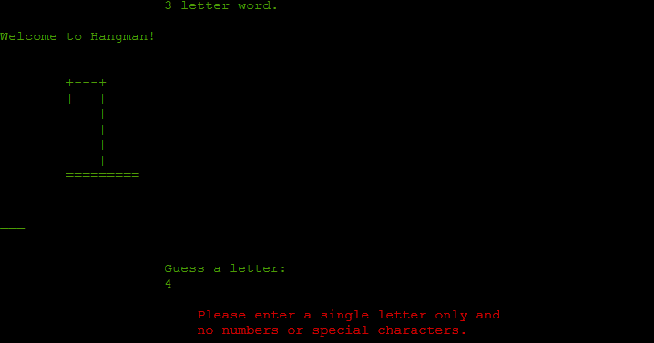

# Hangman
[View The Deployed Site Here](https://hangman-gamer-fa003c400c0e.herokuapp.com/)

## About
The concept of this application was to create an engaging game of hangman for the end-user using Python. 
The game will display the instructions depending on the level selected in the game. Easy mode for 3-letter words, medium mode for 5-letter words, and hard mode for 7-letter words.  
I opted to create the Python code using the programming paradigm, object-oriented programming, or O.O.P.

---

## User stories:
1. As a site user, I would like the site in English so it is understandable to me

1. As a site user, I would like to play a game for healthy brain stimulation 

1. As a site user, I am open-minded and willing to try new games to help my mental health

1. As a site user, I am interested in games as I enjoy the competitiveness 

1. As a site user, I would like the information to be clear so I have a better understanding of what the game does

1. As a site user, I would like to know the game rules, so it makes the experience more fun

1. As a site user, I would like the option of replaying the game once it is finished

### Site Owner:

1. As a site owner, I would like the site to display all the necessary information for site users to understand

1. As a site owner, I would like the game to be intuitive for game users

1. As a site owner, I would like game rules/instructions to be displayed for site users to know how the game is played

--
## How To Play

- The first screen display the various game levels, Easy, Medium & Hard.
    - Easy mode is for guessing 3 letter words in 7 attempts.
    - Medium Mode is for guessing 5 letter words in 7 attempts.
    - Hard mode is for guessing 7 letter words in 7 attempts. 
- The user then selects which level the wish to play by type eitherr, e, m, or h.
    - e = Easy
    - m = Medium
    - h = Hard
- Once the user has selcted their game level they wish to play the instructions are displayed for that level.
- Also displayed is a welcome message, the gallows, the correct number of underscores ( _ )  for that level to dictate the empty word, a prompt asking the user to guess a letter, and an input for the user to enter a letter of their choice.
- Once the user guesses a correct letter & enters it, a congratulations message is displayed. 
- If the user enters a number, more than one letter, or a special character, an error message is displayed.
- If the user guesses the correct word, a congratulations message is displayed.
- If the user does not guess the correct word a warning message is displayed. 
- At the end of the game the user can decided if they wish to replay the game or not. 

## Features

1. Opening Screen

2. Playing ~The Games

3. Errors, Warnings, & Text Dispaly

- Entering a Number:

- Entering a Special Charater:

- Guessing the Wrong Letter:

- Guessing the Correct Letter:

 4. Winning or Lossing the Game

- Losing the Game:

- Winning the Game:

5. Play Again

---

## Technologies used

- ### Languages:

    + [Python](https://developer.mozilla.org/en-US/docs/Glossary/Python): This was used for producing the game itself. 

- ### Programming Paradigm

    + [Object Orientated Programming](https://codeinstitute.net/ie/blog/object-oriented-programming/): This was the paradigm I chose to complete this project. It involves classes and methods that are accessed to complete tasks of a desired outcome. 

- ### Other tools:

    + [GitHub](https://github.com/): This was used to host the source code of the website
    + [GitHub Pages](https://github.com/Ajfriel86/PilatesParadise/settings/pages): This was used to publish the files that were pushed to the repository
    + [VSCode](https://code.visualstudio.com/): This was the IDE used to develop the website
    + [Heroku](https://dashboard.heroku.com/apps): This was used to deply the application
    + [Miro](https://miro.com/) : This was used to create the flowchart

- ### Packages

    + [OS](https://docs.python.org/3/library/os.html ) : This module is built in and provides a portable way of using operating system dependent functionality. This was used to create the clear_screen() function.
    + [Random](https://docs.python.org/3/library/random.html) : This module is built in and implements pseudo-random number generators for various distributions. Specifically for this project, it was used to selected a random word from words.py, depending on the level selected by the user.
    + [Time](https://docs.python.org/3/library/time.html) : This module is built in and provides various time-related functions. The sleep function of Time was used to delay the clear_screen() function so the errors messages where dispalyed long enough for the user to read. 
    + [Colorama](https://pypi.org/project/colorama/) : This module is a third party module and was used to colour the text in the terminal window. 
---

### Flow Chart

## Testing

### Bugs

### Performance

### Validation
#### Python:

---

## Deployment

This website was constructed in VS Code and deployed on [Heroku](https://www.heroku.com/)

### Deployment to Heroku
#### Activating your Heroku Student Pack

- Navigate to https://www.heroku.com/github-students
- Click “Get the student offer”
- Login with Heroku if necessary
- Click “Verify with GitHub”
- Click “Authorize heroku”
- In order to receive the Heroku credits, payment details are required.
- In the new tab, click “Add credit card”.
- Enter your payment details as requested and then head back to the Heroku sign up process
- Enter your details, ensuring to put “Code Institute” as your School name, heed the warning and then click “Send”
- Read Heroku’s terms and click “Agree” to continue
- A thank you message will be shown, indicating that it can take up to 24 hours for the request to be processed

#### Adding an App to Heroku

- On the main page of your Heroku account, select the "New" tab
- Then select "Create New App"
- Add an "App-Name"
- On the newly available page, selcet your deplyment method as GitHub and connect to this
- Enter in the REpo of your project you wish to host on Herko
- Once it is connected, you can then choose "Automatic Deploys" This will automatucally update your application on every push
- The app is now hosted on Heroku [here](https://hangman-gamer-fa003c400c0e.herokuapp.com/)

### Deployment to Git Hub Pages

- Log into GitHub
- Go to the list of repositories on the left-hand side of the screen
- Click on the repository - [Hangman](https://github.com/Ajfriel86/HangManGame)
- Choose the settings tab from the menu items across the top of the page; it is the 9th tab on the menu items list.
- Under 'Code and automation,' the last choice on the list is 'Pages'
- In the 'Source' section, choose 'Deploy from a branch'
- In the 'Branch' section, choose the branch you wish to deploy
- Select, or click, the 'Save' button
- A link to the deployed website is then displayed at the top of the page

### How To Clone a GitHub Repository

- On GitHub.com, navigate to the main page of the repository
- Above the list of files, click <>  Code
- Copy the URL for the repository
- Open Git Bash
- Change the current working directory to the location where you want the cloned directory
- Type git clone, and then paste the URL you copied earlier
- Press Enter to create your local clone

These steps can where found in the help documentation for GitHub here:
- [Cloning a repository](https://docs.github.com/en/repositories/creating-and-managing-repositories/cloning-a-repository)

---

## Credits

- [CPPSecrets](https://cppsecrets.com/users/5617971101051071011161151049711410997484852494964103109971051084699111109/Hangman-Game-using-Python.php) : This site was the inspiration for creating this hangman game
- [How to build HANGMAN with Python in 10 MINUTES](https://www.youtube.com/watch?v=m4nEnsavl6w) : This was used to help with understanding the game in greatrer detail while using Python to create the game
- [How To Print Colored Text in Python (Colorama Tutorial)](https://www.youtube.com/watch?v=u51Zjlnui4Y) : This was used to help understand the use of colorama for changing the colour of the text on the terminal screen
- [Corey Schafer ](https://www.youtube.com/@coreyms) : Corey's YT channel was used to explore in greater detail the Python language and the use of OOP for this language
- [Simple-Terminal-Window](https://pypi.org/project/simple-term-menu/) : This creates simple menus for interactive command line programs
- [Random](https://docs.python.org/3/library/random.html) : This was used to help select a random word from the word dictionary file
- [Gitnux](https://blog.gitnux.com/code/python-clear-console/) : This was used to help clear the terminal window
- [Iuliia Konovalova](https://github.com/IuliiaKonovalova) : I would like to give credit to my mentor for her guidance and inspiration while completing this project. Iuliia helped to point me in the direction that I needed to complete this project

